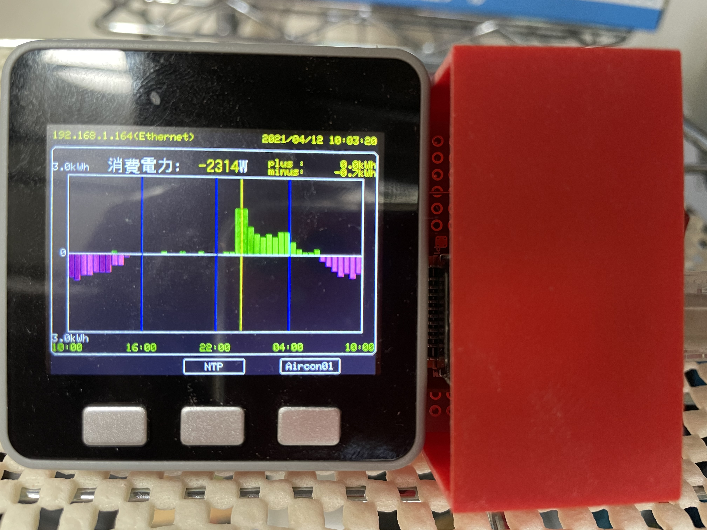
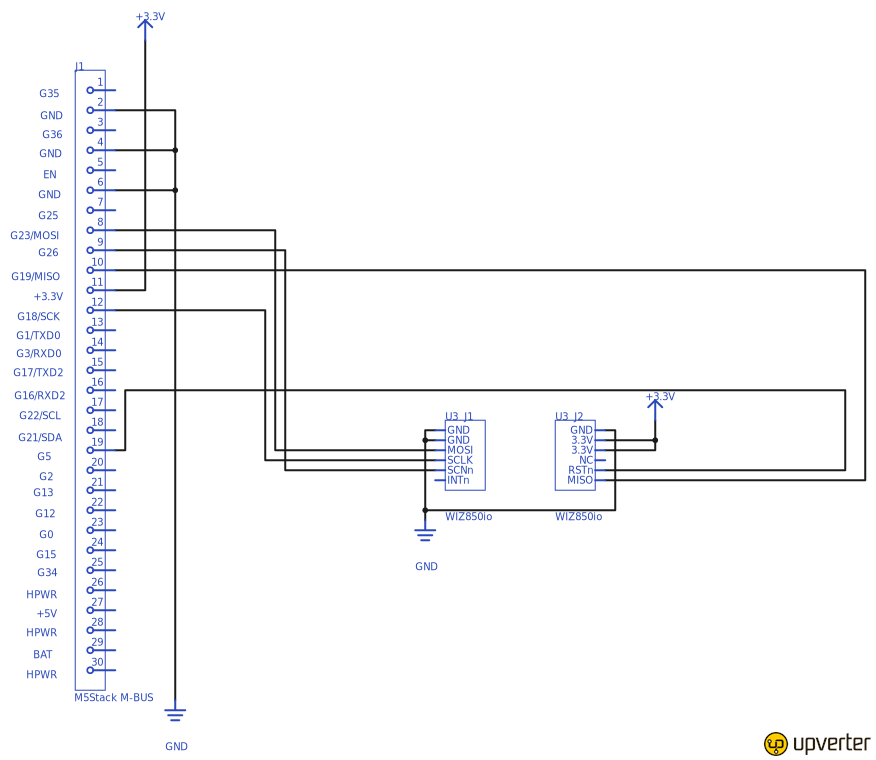

# HomeM5

Home Metrics By M5Stack

# 装置外観



# 構成図


# Grafana によるブラウザ表示イメージ

- 2019/5/30〜2019/6/2 の時系列推移（サンプル）

  - 上から順に、スマートメーター情報（瞬時電力、３０分毎の電力量）、エコキュート情報（タンク残量、消費電力）、BME280 から取得した情報（温度・湿度・気圧）、エアコン情報（室温・外気温・消費電力）

  

# 回路図



# 必要なもの

- ハードウェア
  - M5Stack
- [WIZ850io](https://www.switch-science.com/catalog/3683/)
    - W5500 搭載 Ethernet モジュール（SPI 接続）
  - BME280 搭載モジュール
    - 回路図では、秋月製[AE-BME280](http://akizukidenshi.com/catalog/g/gK-09421/)を使用
- ソフトウェア
  - Visual Studio Code
  - PlatformIO

# 使用ライブラリ

- ArduinoHttpClient ( https://github.com/arduino-libraries/ArduinoHttpClient?utm_source=platformio&utm_medium=piohome )
  - InfluxDB 接続用 HttpClient ライブラリ(Client クラスのラッパ)
- BME280_Light ( https://github.com/EnviroMonitor/BME280_light?utm_source=platformio&utm_medium=piohome )
  - 温度・湿度・気圧センサー（BME280）制御ライブラリ
- M5Stack ( https://github.com/m5stack/m5stack?utm_source=platformio&utm_medium=piohome )
  - M5Stack
  - WiFiClient（Client の派生クラス）
  - WiFiUDP（UDP の派生クラス）
- Ethernet ( https://github.com/arduino-libraries/Ethernet?utm_source=platformio&utm_medium=piohome )
  - EthernetClient（Client の派生クラス）
  - EthernetUDP（UDP の派生クラス）

# コンフィギュレーション

1. config.h
   - define
     - PWD : スマートメーター B ルートサービス パスワード
     - BID : スマートメーター B ルートサービス ID
     - WIFI_SSID : WiFi SSID
     - WIFI_PASS : WiFi Password
     - INFLUX_SERVER : InfluxDB サーバ・アドレス
     - INFLUX_DB : DB 名
     - ECOCUTE_ADDRESS : エコキュート IP アドレス
     - AIRCON_ADDRESS : ダイキンエアコン IP アドレス
     - NTP_SERVER : NTP サーバ・アドレス
   - byte array
     - W5500 MAC アドレス
       - byte mac[] = {0xff, 0xff, 0xff, 0xff, 0xff, 0xff};
1. platformio.ini

   - M5Stack Basic or Gray 使用時
     ```
     board = m5stack-core-esp32
     ```
   - M5Stack FIRE 使用時
     ```
     board = m5stack-fire
     ```

# ビルド

- build & upload

  ```
  platformio run --target upload
  ```
