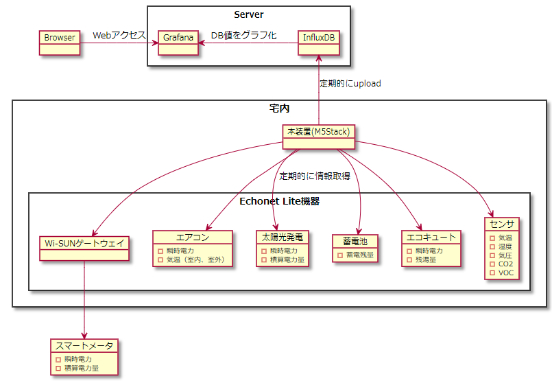

# HomeM5

Home Metrics By M5Stack

# 装置外観


# 構成図



# Grafana によるブラウザ表示イメージ

- 2021/4/11〜2021/4/12 の時系列推移（サンプル）

  - 上から順に、瞬時電力値、積算電力量、蓄電池、CO2 濃度、気温、湿度、エコキュート、気圧

  

# 回路図


# 必要なもの

- ハードウェア
  - M5Stack
- [WIZ850io](https://www.switch-science.com/catalog/3683/)（Ethernet 接続する場合）
  - W5500 搭載 Ethernet モジュール（SPI 接続）
- ソフトウェア
  - Visual Studio Code
  - PlatformIO

# 使用ライブラリ

- ArduinoHttpClient ( https://github.com/arduino-libraries/ArduinoHttpClient?utm_source=platformio&utm_medium=piohome )
  - InfluxDB 接続用 HttpClient ライブラリ(Client クラスのラッパ)
- M5Stack ( https://github.com/m5stack/m5stack?utm_source=platformio&utm_medium=piohome )
  - M5Stack@0.2.6
    - 最新版では ArduinoHttpClient とコンフリクトしてしまうため、0.2.6 版をあえて使用
  - WiFiClient（Client の派生クラス）
  - WiFiUDP（UDP の派生クラス）
- Ethernet3 ( https://github.com/katsumin/Ethernet3/tree/reopen )
  - EthernetClient（Client の派生クラス）
  - EthernetUDP（UDP の派生クラス）
  - オリジナル版を一部改造
    - EthernetClient クラスの write()メソッドを、2048byte 超のサイズに対応
- EL_dev_arduino( https://github.com/katsumin/EL_dev_arduino/tree/UDP )
  - EchonetLite 用ライブラリ
  - オリジナル版を一部改造
    - Ethernet でも使えるように、 WiFiUDP を UDP に変更
- arduino-libraries/NTPClient( https://github.com/arduino-libraries/NTPClient )
  - NTP 用ライブラリ
- lovyan03/LovyanGFX( https://github.com/lovyan03/LovyanGFX )
  - 日本語表示対応ライブラリ

# コンフィギュレーション

1. config.h
   - define
     - WIFI_SSID : WiFi SSID
     - WIFI_PASS : WiFi Password
     - INFLUX_SERVER : InfluxDB サーバ・アドレス
     - INFLUX_DB : DB 名
     - NTP_SERVER : NTP サーバ・アドレス
   - byte array
     - W5500 MAC アドレス
       - byte mac[] = {0xff, 0xff, 0xff, 0xff, 0xff, 0xff};
1. platformio.ini

   - M5Stack Gray 使用時（ただし、FLASH が 4MB の旧タイプは不可）
     ```
     board = m5stack-grey
     board_build.partitions = default_16MB.csv
     ```
   - M5Stack FIRE 使用時
     ```
     board = m5stack-fire
     ```

# ビルド

- build & upload

  ```
  platformio run --target upload
  ```
